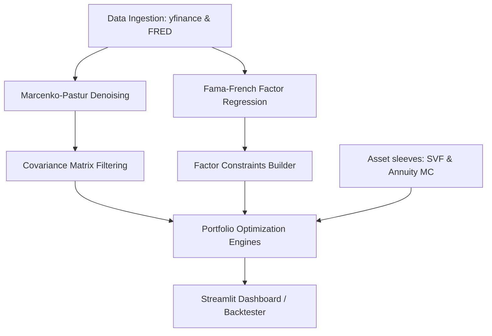

# Antigravity Quant: Multi-Asset Portfolio Optimization & Risk Management Dashboard

[](https://www.python.org/)
[](https://streamlit.io/)
[](#)

Antigravity Quant is an institutional-grade quantitative portfolio optimization and risk management framework. It is specifically designed to address the challenges faced by corporate employees holding highly concentrated technology equity positions (e.g., through stock-based compensation) who have access to a **Self-Directed Brokerage Account (SDBA)** inside a tax-advantaged (Roth 401k) retirement plan. 

By leveraging tax-free rebalancing inside the Roth 401(k) wrapper, the framework allows participants to dynamically reallocate capital across standard equities, fixed-income assets, and alternative sleeves (such as Stable Value Funds and In-Plan Indexed Annuities) without triggering capital gains taxes or immediate tax drag.

---

## 🗺️ Framework Architecture Overview

The system balances high-risk concentrated positions with uncorrelated non-equity risk premia through four core analytical and optimization layers:



---

## ✨ Key Quantitative Pillars

### 1. Advanced Asset sleeves & Alternatives
* **Equity sleeves**: Modeled via custom classes supporting multi-asset weight configurations.
* **Fixed-Income sleeves**: Full pricing engines calculating Macaulay Duration, Modified Duration, Convexity, and Breakeven Inflation derived dynamically from Treasury/TIPS yield spreads.
* **Stable Value Funds (SVF)**: Book-to-market crediting rate convergence smoothing simulation to model unique corporate 401(k) stable asset characteristics.
* **In-Plan Indexed Annuities**: Option-pricing algorithms modeling participation rates, caps, and floors using Monte Carlo stochastic simulation.
* **Sector Rotation**: Machine learning-based Sector Rotator using Random Forests with fallback statistical momentum models.

### 2. Tail-Risk Diagnostics
* **Value at Risk (VaR)** and **Conditional Value at Risk (CVaR / Expected Shortfall)** at custom confidence levels to capture fat-tailed left risk.
* **Maximum Drawdown (Max DD)**, **Calmar Ratio**, and the **Ulcer Index** (accounting for both depth and duration of drawdowns).

### 3. Factor-Based Risk Decomposition
* **Fama-French Five-Factor Model**: Rolling ordinary least squares (OLS) regressions analyzing exposures to Market Premium, Size (SMB), Value (HML), Profitability (RMW), and Investment (CMA).
* **Marcenko-Pastur Denoising**: Random Matrix Theory eigenvalues filtering applied to empirical correlation matrices to filter out estimation noise before feeding covariance inputs to optimization solvers.

### 4. Advanced Optimization Engines
* **Mean-Variance Optimization (MVO)**: Traditional Markowitz framework to maximize Sharpe Ratio.
* **Risk Parity**: Vanilla equal-risk contribution allocations.
* **Hierarchical Risk Parity (HRP) & Hierarchical Equal Risk Contribution (HERC)**: Machine learning clustering-based portfolio construction to bypass unstable covariance inversions.
* **Black-Litterman**: Bayesian model combining market equilibrium with subjective views.
* **Kelly Criterion**: Logarithmic utility maximization to compute growth-optimal betting weights.
* **Shortfall Minimization**: Convex optimization to minimize CVaR or CDaR under customizable target returns and beta bounds.

---

## 📂 Repository Structure

The codebase is modularized as a structured, scalable Python package alongside an interactive dashboard application:

```
InvestmentPortfolio/
├── config/                          # Configuration schemas
│   └── default_config.yaml          # Default tickers, assumptions, and risk limits
├── data/                            # Local database/cache storage
│   ├── cache/                       # Cached market prices and FRED yield rates
│   ├── raw/                         # Raw downloads
│   └── processed/                   # Processed returns
├── portfolio_optimizer/             # Core quantitative engine package
│   ├── analytics/                   # Mathematical diagnostic modules
│   │   ├── risk_metrics.py          # Sharpe, Sortino, Treynor, Information Ratios
│   │   ├── tail_risk.py             # VaR, CVaR, Drawdowns, Ulcer Index
│   │   ├── factor_models.py         # Fama-French regressions & Marcenko-Pastur filter
│   │   ├── fixed_income.py          # Duration, Convexity, TIPS, SVF smoothing
│   │   ├── annuities.py             # MC Option Pricing & Indexed Annuity Payoffs
│   │   └── sector_analysis.py       # ML Random Forest sector rotation classifier
│   ├── optimization/                # Portfolio solvers
│   │   ├── base_optimizer.py        # Solver abstract base class
│   │   ├── traditional.py           # Mean-Variance and Risk Parity
│   │   ├── hierarchical.py          # HRP and HERC solvers
│   │   ├── black_litterman.py       # Black-Litterman engine
│   │   ├── kelly_criterion.py       # Growth-optimal Kelly solver
│   │   ├── shortfall_minimization.py# CVaR/CDaR minimizer
│   │   └── constraints.py           # Target beta bounds and constraint builder
│   ├── data/                        # Live data ingestion layer
│   │   ├── ingestion.py             # FRED & Yahoo Finance fetchers
│   │   ├── cache.py                 # File-system storage manager
│   │   └── validators.py            # Data quality verification checks
│   └── models/                      # Domain class schemas
│       ├── asset.py                 # Equity, SVF, Annuity, REIT, FixedIncome representations
│       ├── portfolio.py             # Portfolio container holding asset weight vectors
│       └── optimization_result.py   # Standard output results schema
├── dashboard/                       # Streamlit web app
│   ├── components/                  # Reusable visualization components
│   ├── pages/                       # Multi-page dashboard layouts
│   │   ├── 01_Data_Ingestion.py     # Live ingestion console
│   │   ├── 02_Analytics.py          # Deep dives on alternative assets & metrics
│   │   ├── 03_Optimization.py       # Optimization setup and allocation charts
│   │   └── 04_Backtesting.py        # Historical backtesting comparisons
│   ├── style.css                    # Glassmorphism dark-mode UI stylesheet
│   └── app.py                       # Main Streamlit landing screen
├── scripts/                         # Command-line scripts
│   └── run_verification.py          # Unit test runner
├── tests/                           # Verification unit test suite
│   └── unit/                        # Test scripts checking math & solvers
├── pyproject.toml                   # Project dependencies and packaging settings
└── README.md                        # Framework overview (this file)
```

---

## ⚡ Setup & Installation

This project is configured to use the high-performance Python package manager **`uv`**.

### 1. Prerequisites
Ensure you have Python 3.14+ (or standard 3.10+) installed. Installing `uv` is highly recommended:
```powershell
# Install uv (Windows Powershell)
irm https://astral.sh/uv/install.ps1 | iex
```

### 2. Sync Environment
Install project dependencies and build the virtual environment:
```powershell
# Sync and set up virtual env
uv sync
```

### 3. Run Verification Tests
Verify the mathematical operations and optimization solvers are executing correctly on your system:
```powershell
uv run python scripts/run_verification.py
```

---

## 🖥️ Launching the Interactive Dashboard

Launch the Streamlit web dashboard to run quantitative analysis, construct portfolios, and perform backtesting through a premium, glassmorphism dark-mode GUI:

```powershell
uv run streamlit run dashboard/app.py
```

### 📍 Dashboard Pages & Flow:
1. **01 Data Ingestion**: Pick your universe tickers (e.g. `QQQ`, `SPY`, `VNQ`, `TLT`, `TIP`), set FRED API keys, and download historical data.
2. **02 Analytics**: Interactively calculate bond durations, run Fama-French regressions, simulate SVF rate adjustments, and view Monte Carlo annuity option tables.
3. **03 Optimization**: Set asset boundary limits, specify a target portfolio beta constraint, choose your optimizer (e.g., HRP, CVaR Min, Kelly), and compare weight compositions.
4. **04 Backtesting**: Run out-of-sample backtests, graphing cumulative returns and displaying metric comparisons (Sharpe, Max Drawdown, Calmar) against baseline benchmarks.

---

## 📈 Code Usage Examples

### 1. Run Portfolio Optimization
Here is a programmatic example of fetching returns and running Mean-Variance Optimization:

```python
import numpy as np
import pandas as pd
from portfolio_optimizer.optimization.traditional import MeanVarianceOptimizer
from portfolio_optimizer.utils.helpers import generate_sample_returns

# 1. Prepare asset returns
tickers = ["QQQ", "SPY", "TLT", "TIP"]
returns = generate_sample_returns(tickers, periods=100)

# 2. Initialize and solve Max Sharpe Portfolio
mvo = MeanVarianceOptimizer()
result = mvo.optimize(returns)

# 3. Print allocations
print(f"Solver: {result.optimizer_name}")
for ticker, weight in zip(tickers, result.weights):
    print(f"  {ticker}: {weight * 100:.2f}%")
```

### 2. Pricing Alternative Assets (Indexed Annuity Payoff)
```python
from portfolio_optimizer.analytics.annuities import calculate_indexed_annuity_payoff
import numpy as np

# Sample index return vector
index_returns = np.array([0.15, -0.05, 0.04])

# Apply annuity contract terms (80% participation, 8% cap, 0% floor)
annuity_returns = calculate_indexed_annuity_payoff(
    index_returns, 
    participation_rate=0.80, 
    cap_rate=0.08, 
    floor_rate=0.0
)

# Output: [0.08, 0.0, 0.032]
print("Annuity Credited Rates:", annuity_returns)
```

---

## 🛠️ Configuration
You can customize the asset assumptions, initial rates, Fama-French database link, and optimization parameters directly in `config/default_config.yaml`:

* `default_tickers`: Ticker lists loaded during initialization.
* `stable_value_fund`: Crediting rate convergence speeds and parameters.
* `annuity`: Contract participation ratios, floor, and cap metrics.
* `default_target_beta`: Limit bounds for portfolio risk hedging.
